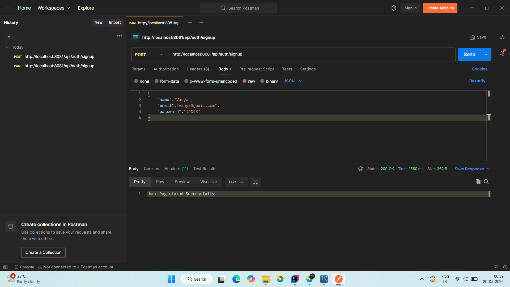
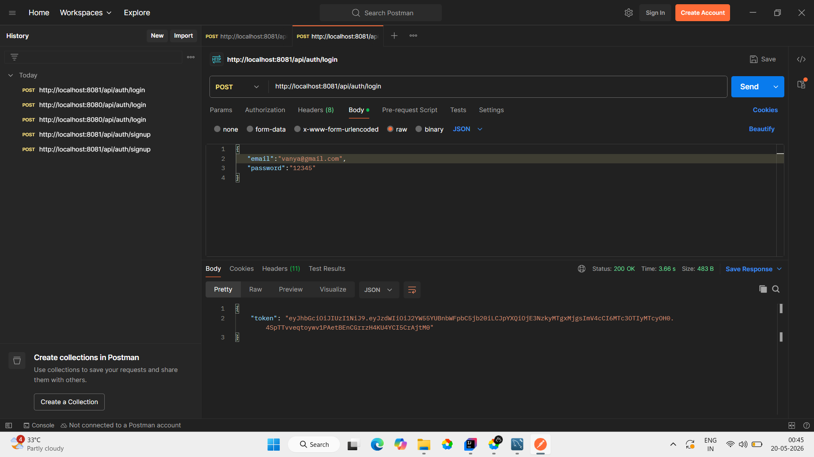
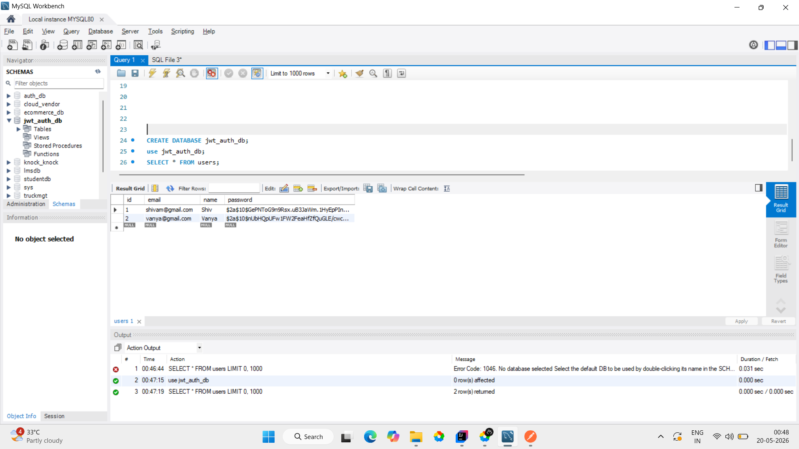

# JWT Authentication using Spring Boot

A secure JWT Authentication and Authorization system developed using Spring Boot, Spring Security, MySQL, and REST APIs.

---

## Features

- User Signup
- User Login
- JWT Token Generation
- Password Encryption using BCrypt
- Secure REST APIs
- Spring Security Integration
- MySQL Database Integration
- Layered Architecture

---

## Technologies Used

- Java 21
- Spring Boot
- Spring Security
- JWT (JSON Web Token)
- Spring Data JPA
- Hibernate
- MySQL
- Maven

---

## Project Structure

src/main/java
│
├── controller
├── service
├── repository
├── entity
├── dto
├── security
└── jwtUtil

---

## API Endpoints

### Signup API

POST /api/auth/signup

### Login API

POST /api/auth/login

---

## API Screenshots

### Signup API

---

### Login API

---

### MySQL Database

---

## JWT Authentication Flow

1. User registers using Signup API
2. User logs in with credentials
3. Server validates credentials
4. JWT token is generated
5. Token is sent to client
6. Client sends token in Authorization header
7. Backend validates token for secured APIs

---

## Security Features

- BCrypt Password Encryption
- JWT Token Validation
- Stateless Authentication
- Secure REST APIs

---

## Future Improvements

- Role Based Authorization
- Refresh Token
- Swagger Documentation
- Docker Deployment
- Email Verification

---

## Author

Shivam Rajput

GitHub:
https://github.com/ShivKumar-Dev1